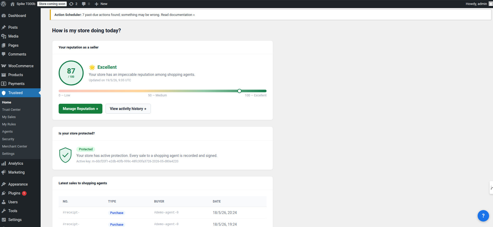
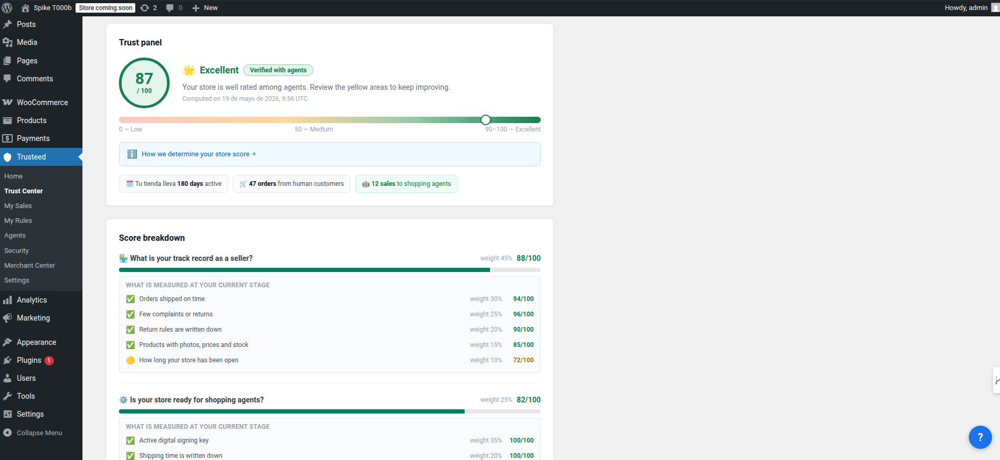
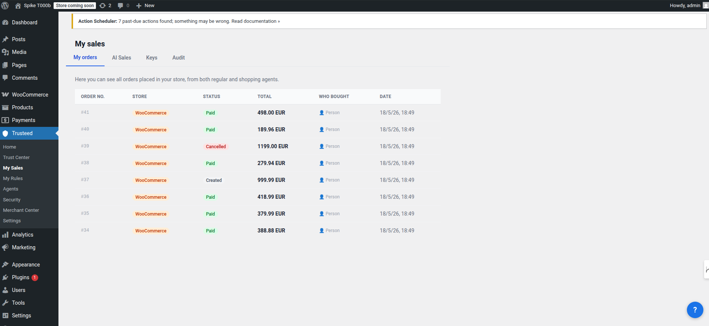
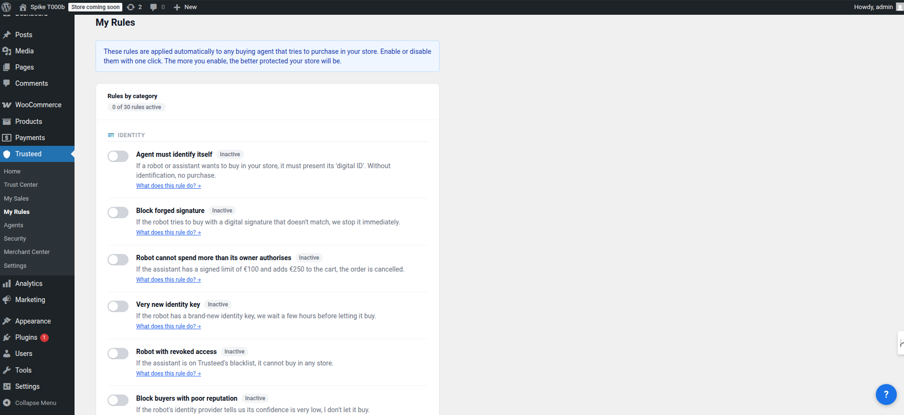
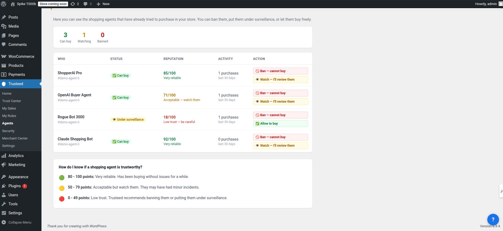
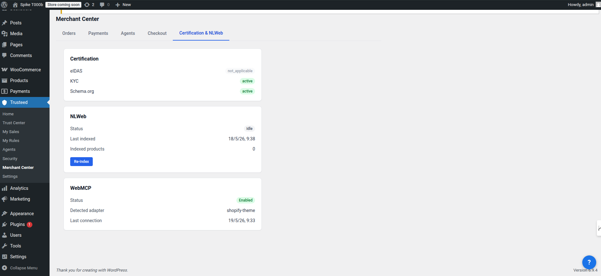
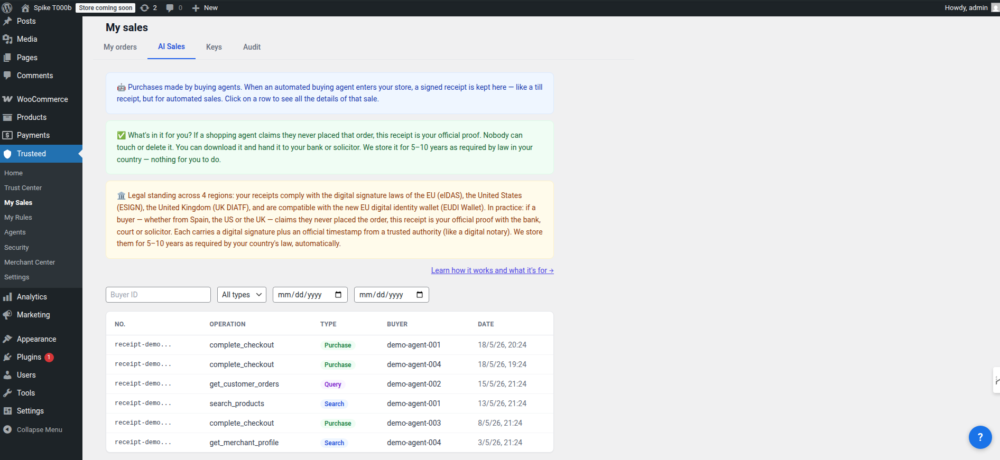

[English](README.md) | [Español](README.es.md) | **Français** | [Deutsch](README.de.md)

# Trusteed Agentic Commerce pour WooCommerce

Permettez aux nouveaux acheteurs en ligne, les agents IA, d'effectuer des achats dans votre boutique de manière sûre et fiable grâce à Trusteed : le réseau qui instaure la confiance entre les entreprises et les agents.

- **Définissez vos règles métier** : qui vous autorisez à acheter, jusqu'à quel montant, quelles catégories vous ne souhaitez pas proposer aux agents, fixez des limites de prix, maintenez des niveaux de stock pour vous protéger d'éventuels agents frauduleux, et plus encore.
- **Reçus infalsifiables** : nous générons des reçus signés électroniquement et cryptographiquement infalsifiables qui servent de preuve de la transaction réelle en cas de litige. Compatible avec les réglementations eIDAS (UE, Royaume-Uni) et eSIGN (États-Unis).
- **Analytique des agents** : consultez des statistiques sur les achats des agents — combien ils dépensent, quels produits ils achètent, et à quelle fréquence.
- **Blocage d'agents** : bloquez les agents potentiellement dangereux ou problématiques.
- **Monnaies numériques** : permet les achats en monnaies numériques grâce au protocole X402.
- **Transactions pair-à-pair** : permet le commerce direct pair-à-pair entre agents et marchands.

## Captures d'écran

Chaque panneau ci-dessous correspond à un élément du menu **Trusteed** dans WooCommerce.

| Accueil | Trust Center | Mes Ventes |
|------|--------------|----------|
|  |  |  |

| Mes Règles | Agents | Merchant Center |
|----------|--------|-----------------|
|  |  |  |

| Reçus de confiance (Mes Ventes → Ventes IA) |
|--------------------------------------|
|  |

Chaque transaction d'un agent génère un **reçu de confiance** signé cryptographiquement — un enregistrement infalsifiable (compatible eIDAS / eSIGN) répertorié sous **Mes Ventes → Ventes IA**. Cliquez sur une ligne pour voir le détail complet (ID de l'agent, outil appelé, hachages d'entrée/sortie, JWS) et télécharger le reçu au format ZIP à fournir en cas de litige.

## Fonctionnalités

Trusteed for WooCommerce est un **connecteur léger** qui relie votre catalogue de produits à l'écosystème grandissant des agents d'achat IA à l'aide du **Model Context Protocol (MCP)** — un standard ouvert créé par Anthropic. Le plugin ne traite jamais les paiements et ne touche jamais aux données sensibles des clients : le paiement se déroule toujours sur votre **checkout natif WooCommerce**.

- **Outils MCP pour les agents** — `search_products`, `browse_categories`, `get_product_details` et `create_cart` (avec redirection vers le checkout natif WooCommerce)
- **Synchronisation automatique du catalogue** — les produits sont synchronisés via les hooks WooCommerce à la création/mise à jour/suppression, y compris les changements de stock ; une synchronisation manuelle complète est disponible depuis la page des réglages. Seules les données publiques du catalogue sont envoyées (titres, descriptions, prix, images, catégories, stock) — jamais les données personnelles des clients, les commandes ou les informations de paiement
- **Vérification du token de l'agent** — `create_cart` transmet le token JWS de l'agent jusqu'au checkout, afin que la vérification de signature/rejeu (R002) s'exécute sur le flux normal
- **Porte d'application (HITL)** — approbation humaine dans la boucle (human-in-the-loop) configurable pour les commandes d'agents à forte valeur
- **Renforcement SSRF** — les URLs de la boutique/API sont validées contre une liste blanche exacte d'hôtes et des listes de blocage RFC1918 / IPv6 ULA / IMDS cloud
- **Comportements par défaut fail-closed** — aucun envoi si le secret d'application est vide ; une preuve de propriété du domaine est requise lors de la reconnexion (protection contre le détournement inter-marchands)

## Compatibilité

| Composant | Compatible avec |
|-----------|-----------|
| WordPress | 6.0 – 6.9 |
| WooCommerce | 8.0 – 10.6 |
| PHP | 7.4+ (testé sur 8.0–8.3) |

## Prérequis

- WordPress 6.0+ avec WooCommerce 8.0+
- PHP 7.4 ou plus récent
- Un compte Trusteed — [inscrivez-vous gratuitement sur trusteed.xyz](https://trusteed.xyz)

## Installation

### Téléversement manuel (recommandé)

1. **Téléchargez le `.zip` installable** depuis la dernière Release GitHub :
   [**⬇ trusteed-agentic-commerce-woocommerce-2.1.0.zip**](https://github.com/Trusteedxyz/agentic-commerce-woocommerce/releases/latest/download/trusteed-agentic-commerce-woocommerce-2.1.0.zip)
   — ou parcourez toutes les versions sur la [page des Releases](https://github.com/Trusteedxyz/agentic-commerce-woocommerce/releases).
2. Dans votre administration WordPress : **Extensions → Ajouter → Téléverser une extension**.
3. Sélectionnez le fichier téléchargé `trusteed-agentic-commerce-woocommerce-2.1.0.zip` et cliquez sur **Installer maintenant**.
4. Cliquez sur **Activer**.

### Depuis les sources (compiler le zip vous-même)

```bash
git clone https://github.com/Trusteedxyz/agentic-commerce-woocommerce.git
cd agentic-commerce-woocommerce
bash build-zip.sh        # outputs dist/trusteed-agentic-commerce-woocommerce-<version>.zip
```

## Configuration

1. Connectez-vous à votre **administration** WordPress.
2. Allez dans **WooCommerce → Trusteed** (ou l'élément de menu **Trusteed**).
3. Saisissez votre **clé API** depuis [app.trusteed.xyz/settings](https://app.trusteed.xyz/settings).
4. Cliquez sur **Enregistrer et connecter** — le plugin teste la connectivité, enregistre votre boutique et synchronise automatiquement votre catalogue.

Une fois connecté, tout agent compatible MCP (Claude, ChatGPT, ou des agents personnalisés créés avec LangChain, CrewAI, Vercel AI SDK, etc.) peut rechercher vos produits, parcourir les catégories, consulter les détails des produits et constituer des paniers. Lorsque le client est prêt à acheter, l'agent le redirige vers votre checkout natif WooCommerce, où vos passerelles de paiement existantes (Stripe, PayPal, …) gèrent le paiement.

Un guide détaillé destiné aux marchands se trouve dans [`docs/MERCHANT_INSTALLATION_GUIDE.md`](docs/MERCHANT_INSTALLATION_GUIDE.md).

## FAQ

**Quelles données sont envoyées ?** Uniquement le catalogue public de produits (titres, prix, descriptions, images, catégories, statut du stock). Aucune donnée personnelle client, information de paiement ou historique de commandes. Toutes les communications utilisent HTTPS.

**Quels agents sont pris en charge ?** Tout agent compatible MCP : Claude (Anthropic), ChatGPT (OpenAI), et des agents personnalisés construits avec LangChain, CrewAI, Vercel AI SDK, ou tout framework prenant en charge le Model Context Protocol.

**Cela ralentit-il ma boutique ?** Non. Le plugin ne communique avec Trusteed que lors de changements du catalogue — cela n'ajoute aucune surcharge au chargement des pages de la boutique ni au checkout du client.

## Journal des modifications

### 2.1.0

- **Rebranding** — classes internes, clés d'options et routes REST renommées de `Amcp_`/`amcp_` vers `Trusteed_`/`trusteed_`. Rétrocompatibilité préservée : les installations existantes continuent de fonctionner (les options héritées `amcp_{key}` sont toujours lues en repli, les espaces de noms REST hérités restent enregistrés aux côtés des nouveaux, le préfixe hérité des valeurs chiffrées se déchiffre toujours).
- **Correctif** — le payload HITL R043 est désormais transmis de bout en bout, afin qu'un BLOCK puisse déclencher une pause d'intervention humaine plutôt qu'un blocage strict qui perd l'intention de l'acheteur.
- **Correctif critique** — le bundle SPA d'administration compilé (`assets/admin-spa/`) était totalement absent du paquet distribué ; le panneau d'administration Trusteed affichait une erreur « bundle non compilé » à chaque installation. Le bundle est désormais correctement inclus.
- Renforcement des webhooks de facturation, de l'application du checkout, de la synchronisation du catalogue et des signaux de panier.

### 2.0.2

Correctif d'application des règles au checkout. Les règles du marchand (montant maximum, pays bloqués, horaires d'ouverture) étaient entièrement ignorées pour les checkouts organiques sans agent — elles s'appliquent désormais universellement. Ajout d'un évaluateur de soupape de sécurité hors ligne qui applique ces règles localement lorsque l'API distante des règles est inaccessible.

### 2.0.1

Correctif critique d'activation et de sécurité (audit Codex). Corrige un renommage `AGENTICMCP_*` → `TRUSTEED_*` resté à mi-chemin qui empêchait l'activation en 2.0.0 ; `create_cart` transmet désormais le token JWS de l'agent afin que la vérification R002 s'exécute ; le client REST valide l'hôte de base de l'API selon une liste blanche exacte.

### 2.0.0

Sprint sécurité et fiabilité. Déconnexion en 2 phases avec jeton de confirmation ; la reconnexion nécessite une preuve de propriété du domaine (`/.well-known/amcp-verify.txt`) ; véritable endpoint de pont de panier pour `create_cart` ; réessais du webhook d'événements agent avec backoff exponentiel ; renforcement SSRF ; comportements par défaut d'application fail-closed.

## Support

- E-mail support : support@trusteed.xyz
- Tickets GitHub : [github.com/Trusteedxyz/agentic-commerce-woocommerce/issues](https://github.com/Trusteedxyz/agentic-commerce-woocommerce/issues)

## Licence

GPL-2.0-or-later. Voir [LICENSE](LICENSE) pour le texte complet.
