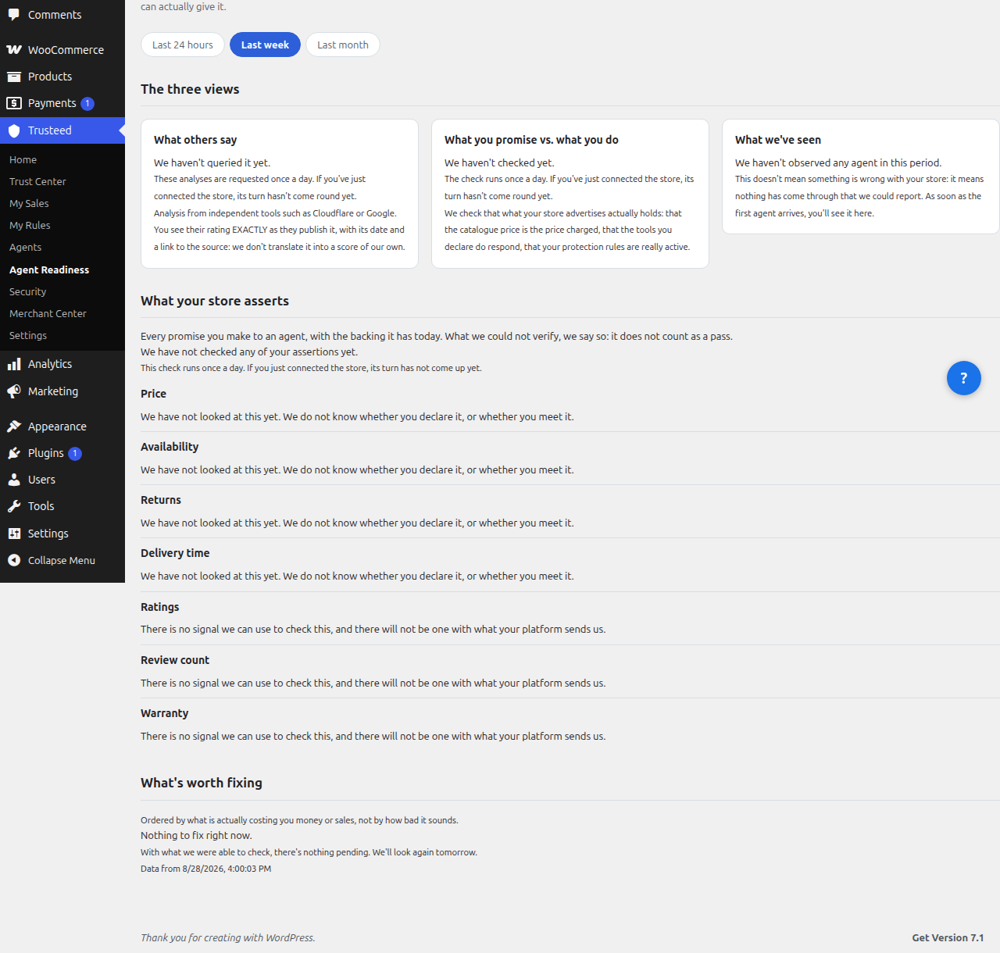

[English](README.md) | [Español](README.es.md) | **Français** | [Deutsch](README.de.md)

# Trusteed Agentic Commerce pour WooCommerce

Permettez aux nouveaux acheteurs en ligne, les agents IA, d'effectuer des achats dans votre boutique de manière sûre et fiable grâce à Trusteed : le réseau qui instaure la confiance entre les entreprises et les agents.

- **Définissez vos règles métier** : qui vous autorisez à acheter, jusqu'à quel montant, quelles catégories vous ne souhaitez pas proposer aux agents, fixez des limites de prix, maintenez des niveaux de stock pour vous protéger d'éventuels agents frauduleux, et plus encore.
- **Reçus à falsification détectable** : nous générons des reçus signés électroniquement et cryptographiquement résistants à la falsification qui enregistrent ce que l'agent a réellement fait — une preuve vérifiable de l'intégrité de l'agent. Ils sont conçus pour suivre la norme européenne de signature électronique (eIDAS) et eSIGN (États-Unis), mais ne constituent pas encore une signature ni un horodatage *qualifiés* : seuls, ils ne sont donc pas une preuve de litige prête à être présentée à une banque ou à un tribunal.
- **Analytique des agents** : consultez des statistiques sur les achats des agents — combien ils dépensent, quels produits ils achètent, et à quelle fréquence.
- **Blocage d'agents** : bloquez les agents potentiellement dangereux ou problématiques.
- **Monnaies numériques** : permet les achats en monnaies numériques grâce au protocole X402.
- **Transactions pair-à-pair** : permet le commerce direct pair-à-pair entre agents et marchands.
- **Tableau de bord Agent Readiness** : vérifie en direct si les agents IA peuvent réellement acheter dès aujourd'hui dans votre boutique — trois vues indépendantes (ce que disent les autres, ce que vous promettez vs. ce que vous faites, ce que nous avons observé), sans les fusionner en un score inventé.

## Captures d'écran

Chaque panneau ci-dessous correspond à un élément du menu **Trusteed** dans WooCommerce.

| Accueil | Trust Center | Mes Ventes |
|------|--------------|----------|
|  |  |  |

| Mes Règles | Agents | Merchant Center |
|----------|--------|-----------------|
|  |  |  |

| Reçus de confiance (Mes Ventes → Ventes IA) | Agent Readiness |
|--------------------------------------|------------------|
|  |  |

Chaque transaction d'un agent génère un **reçu de confiance** signé cryptographiquement — un enregistrement infalsifiable (compatible eIDAS / eSIGN) répertorié sous **Mes Ventes → Ventes IA**. Cliquez sur une ligne pour voir le détail complet (ID de l'agent, outil appelé, hachages d'entrée/sortie, JWS) et télécharger le reçu au format ZIP. L'export est une preuve vérifiable de l'intégrité de l'agent : un appui utile si un acheteur affirme n'avoir jamais passé la commande, mais seul, il ne remplace pas les preuves qu'une banque ou un tribunal peut exiger en cas de litige.

## Fonctionnalités

Trusteed for WooCommerce est un **connecteur léger** qui relie votre catalogue de produits à l'écosystème grandissant des agents d'achat IA à l'aide du **Model Context Protocol (MCP)** — un standard ouvert créé par Anthropic. Le plugin ne traite jamais les paiements et ne touche jamais aux données sensibles des clients : le paiement se déroule toujours sur votre **checkout natif WooCommerce**.

- **Outils MCP pour les agents** — `search_products`, `browse_categories`, `get_product_details` et `create_cart` (avec redirection vers le checkout natif WooCommerce)
- **Synchronisation automatique du catalogue** — les produits sont synchronisés via les hooks WooCommerce à la création/mise à jour/suppression, y compris les changements de stock ; une synchronisation manuelle complète est disponible depuis la page des réglages. Seules les données publiques du catalogue sont envoyées (titres, descriptions, prix, images, catégories, stock) — jamais les données personnelles des clients, les commandes ou les informations de paiement
- **Vérification du token de l'agent** — `create_cart` transmet le token JWS de l'agent jusqu'au checkout, afin que la vérification de signature/rejeu (R002) s'exécute sur le flux normal
- **Porte d'application (HITL)** — approbation humaine dans la boucle (human-in-the-loop) configurable pour les commandes d'agents à forte valeur
- **Renforcement SSRF** — l'URL de base de l'API porteuse de identifiants doit être en HTTPS et figurer sur une liste blanche exacte d'hôtes ; l'IMDS cloud (`169.254.0.0/16`, `100.100.100.200`, `metadata.google.internal`), l'IPv6 unique-local (`fc00::/7`) et le link-local (`fe80::/10`) sont bloqués dans tous les environnements, et loopback / RFC1918 ne fonctionnent qu'après activation explicite de `TRUSTEED_ALLOW_LOCAL_API_BASE` (désactivé par défaut)
- **Comportements par défaut fail-closed** — aucun envoi si le secret d'application est vide ; une preuve de propriété du domaine est requise lors de la reconnexion (protection contre le détournement inter-marchands)

## Compatibilité

| Composant | Compatible avec |
|-----------|-----------|
| WordPress | 6.0 – 6.9 |
| WooCommerce | 8.0 – 10.6 |
| PHP | 7.4+ (testé sur 8.0–8.3) |

## Prérequis

- WordPress 6.0+ avec WooCommerce 8.0+
- PHP 7.4 ou plus récent
- Un compte Trusteed — [inscrivez-vous gratuitement sur trusteed.xyz](https://trusteed.xyz)

## Installation

### Téléversement manuel (recommandé)

1. **Téléchargez le `.zip` installable** depuis la dernière Release GitHub :
   [**⬇ Dernière release — trusteed-agentic-commerce-woocommerce-&lt;version&gt;.zip**](https://github.com/Trusteedxyz/agentic-commerce-woocommerce/releases/latest)
   — ou parcourez toutes les versions sur la [page des Releases](https://github.com/Trusteedxyz/agentic-commerce-woocommerce/releases).
2. Dans votre administration WordPress : **Extensions → Ajouter → Téléverser une extension**.
3. Sélectionnez le fichier `.zip` téléchargé et cliquez sur **Installer maintenant**.
4. Cliquez sur **Activer**.

### Depuis les sources (compiler le zip vous-même)

```bash
git clone https://github.com/Trusteedxyz/agentic-commerce-woocommerce.git
cd agentic-commerce-woocommerce
bash build-zip.sh        # outputs dist/trusteed-agentic-commerce-woocommerce-<version>.zip
```

## Configuration

1. Connectez-vous à votre **administration** WordPress.
2. Allez dans **WooCommerce → Trusteed** (ou l'élément de menu **Trusteed**).
3. Saisissez votre **clé API** depuis [trusteed.xyz/dashboard/settings](https://trusteed.xyz/dashboard/settings).
4. Cliquez sur **Enregistrer et connecter** — le plugin teste la connectivité, enregistre votre boutique et synchronise automatiquement votre catalogue.

Une fois connecté, tout agent compatible MCP (Claude, ChatGPT, ou des agents personnalisés créés avec LangChain, CrewAI, Vercel AI SDK, etc.) peut rechercher vos produits, parcourir les catégories, consulter les détails des produits et constituer des paniers. Lorsque le client est prêt à acheter, l'agent le redirige vers votre checkout natif WooCommerce, où vos passerelles de paiement existantes (Stripe, PayPal, …) gèrent le paiement.

Un guide détaillé destiné aux marchands se trouve dans [`docs/MERCHANT_INSTALLATION_GUIDE.md`](docs/MERCHANT_INSTALLATION_GUIDE.md).

## FAQ

**Quelles données sont envoyées ?** Uniquement le catalogue public de produits (titres, prix, descriptions, images, catégories, statut du stock). Aucune donnée personnelle client, information de paiement ou historique de commandes. Toutes les communications utilisent HTTPS.

**Quels agents sont pris en charge ?** Tout agent compatible MCP : Claude (Anthropic), ChatGPT (OpenAI), et des agents personnalisés construits avec LangChain, CrewAI, Vercel AI SDK, ou tout framework prenant en charge le Model Context Protocol.

**Cela ralentit-il ma boutique ?** Non. Le plugin ne communique avec Trusteed que lors de changements du catalogue — cela n'ajoute aucune surcharge au chargement des pages de la boutique ni au checkout du client.

## Le tableau de bord de préparation agentique

**Les agents me trouvent-ils ?** est une page de votre panneau d'administration
qui répond à une seule question : lorsqu'un agent d'achat IA visite votre
boutique, obtient-il ce que vous croyez qu'il obtient ?

Aucune note unique n'est affichée. Trois colonnes, jamais moyennées, car elles
répondent à des questions différentes et peuvent légitimement se contredire :

| Colonne | Ce que c'est |
| --- | --- |
| **Ce que dit un tiers** | Le verdict d'un scanner externe, cité tel quel. Jamais réinterprété dans une échelle qui serait la nôtre : dès que l'on convertit la note d'un autre, on corrige sa propre copie |
| **Ce que vous dites correspond-il à ce que vous faites ?** | 16 vérifications qui confrontent ce que votre boutique **annonce** à ce qu'elle **répond réellement**. C'est la partie qu'aucun scanner externe ne peut faire : elle exige vos identifiants |
| **Ce que nous avons vu passer** | Le trafic agentique réel sur la période choisie : quels agents sont venus, quels outils ils ont utilisés, jusqu'où ils sont allés et où ils ont échoué |

Une vérification qui n'a pas pu être faite est signalée comme **non vérifiée**,
avec son motif. Elle n'est jamais écartée en silence ni comptée comme réussie.
« Nous n'avons pas pu regarder » et « nous avons regardé et tout allait bien »
sont deux réponses distinctes, et la page indique laquelle s'applique.

### Ce que vérifie chaque contrôle

| Contrôle | Ce qu'il détecte |
| --- | --- |
| C1 | Vous annoncez des outils que votre boutique ne sert pas |
| C2 | Vous annoncez un protocole de paiement dont le point de terminaison ne répond pas |
| C3 | Le prix du catalogue n'est pas le prix facturé |
| C4 | Annoncé disponible alors que ce n'est pas le cas |
| C5 | Votre politique de retour dit des choses différentes selon la source |
| C6 | Vous annoncez comme disponible quelque chose qui est désactivé |
| C7 | Des règles activées qui ne peuvent pas agir faute de données |
| C8 | Vos règles observent mais ne bloquent pas |
| C9 | La méthode d'identification que vous annoncez ne fonctionne pas |
| C10 | Un agent peut acheter n'importe quel montant sans votre confirmation |
| C11 | Le point de vente utilise des règles expirées |
| C12 | Des opérations sans reçu signé |
| C13 | Des adresses annoncées qui ne fonctionnent pas |
| C14 | Les agents voient des données périmées de votre boutique |
| C15 | Des justificatifs d'identité sur le point d'expirer |
| C16 | Le délai de livraison promis n'est pas celui que vous tenez |

Certains contrôles ont besoin de plus que vos réglages, et la page le dit au lieu
de laisser un vide :

- **Nécessite une boutique connectée** (C3, C4, C5, C14) : ils comparent avec
  votre catalogue réel, et sans identifiants il n'y a rien à comparer.
- **Nécessite des commandes livrées** (C16) : il compare ce que vous promettez à
  ce que vous avez réellement tenu, ce qui est impossible sans historique.
- **Rien à comparer cette fois** : C12, par exemple, n'a rien à vérifier tant
  qu'un agent n'a pas réellement finalisé un achat. Ce n'est pas un échec.

Les contrôles s'exécutent une fois par jour et la page affiche le résultat **avec
sa date**, pour qu'un verdict d'hier ressemble à un verdict d'hier. Un « tout va
bien » mis en cache et présenté comme actuel serait exactement l'auto-illusion
que cette page existe pour débusquer.

## Journal des modifications

### 2.3.3

- Nouveau : les Réglages vous permettent désormais de choisir les outils que votre boutique propose aux agents. Si vous n'avez jamais enregistré de liste, le panneau vous indique que ce qui est proposé est l'ensemble de base fourni par la plateforme, et non votre choix.
- Nouveau : un bouton pour relancer la vérification sans attendre le balayage quotidien, et le panneau retient ce qui a changé depuis la vérification précédente.
- Modifié : nos propres pannes ne comptent plus comme des incohérences de votre boutique. Le panneau les sépare, car vous n'y pouvez rien.

### 2.3.2

- Corrigé : la page de disponibilité pour les agents était publiée sans sa feuille de style, le panneau s'affichait donc sans mise en forme.
- Corrigé : le panneau pouvait afficher son interface dans une langue et le diagnostic dans une autre. La langue résolue accompagne désormais les textes au lieu d'être détectée deux fois.
- Nouveau : chaque constat renvoie vers l'endroit où le corriger, et les affirmations du marchand — le délai de livraison et les autres — apparaissent avec les éléments qui les étayent.
- Modifié : une boutique sans aucune vérification affiche « vérification en cours » au lieu de « vérifié une fois par jour » : ouvrir le panneau déclenche déjà la première vérification en arrière-plan.

### 2.3.1

- **Correction critique** — la 2.3.0 comportait une erreur de syntaxe PHP dans le routeur d'administration (`->render_spa_shell()` sans `$this`, et `array( , 'render_agent_readiness' )`). Son activation mettait en panne **tout l'administration WordPress**, pas seulement les pages Trusteed. Si vous êtes en 2.3.0, mettez à jour immédiatement. Tous les fichiers PHP du plugin sont désormais vérifiés syntaxiquement.
- **Corrigé** — la page « Agent Readiness » affichait le Trust Center. Le montage de la SPA valide la section contre une liste blanche où `agent-readiness` manquait, avec repli silencieux : le marchand cliquait « Agent Readiness » et voyait un autre panneau.

### 2.3.0

- **Nouveau — tableau de bord de préparation agentique.** *Les agents me trouvent-ils ?* arrive dans le panneau d'administration. Il confronte ce que votre boutique annonce à ce qu'elle répond réellement, en **16 vérifications**, et les affiche toutes les seize, pas seulement celles qui échouent. Une vérification impossible indique **pourquoi** (boutique non connectée, aucune commande livrée pour l'instant, rien à comparer cette fois) au lieu de laisser un vide qui ressemble à une panne. Voir « Le tableau de bord de préparation agentique » ci-dessus.
- **Corrigé** — le diagnostic était rédigé en espagnol dans l'API et affiché tel quel : un marchand utilisant le panneau en anglais lisait des titres anglais au-dessus de constats espagnols. Les vérifications émettent désormais des codes neutres et le texte est composé au moment de servir, dans votre langue.
- **Corrigé** — la vérification C1 (« vous annoncez des outils que votre boutique ne sert pas ») considérait tout le catalogue public comme servi en l'absence de liste configurée : elle annonçait 46 sur 48 alors que le serveur en sert 12. L'erreur allait dans le sens flatteur, précisément celui que ce tableau de bord doit débusquer.
- **Corrigé** — la vérification C6 (« vous annoncez comme disponible quelque chose qui est désactivé ») signalait une capacité comme désactivée dès que son indicateur n'était pas défini, y compris pour ceux activés par défaut. C'était une fausse alerte sur toutes les boutiques.

### 2.2.2

- **Correctif de sécurité** — le client API acceptait une URL de base en loopback ou dans une plage privée RFC1918 (`10.*`, `172.16–31.*`, `192.168.*`, `localhost`, `127.*`) dans **tous** les environnements, y compris en HTTP simple. Une installation dont l'URL d'API aurait été redirigée enverrait ses identifiants `X-AgenticMCP-Key` vers une adresse interne. Ce mode développement doit désormais être activé explicitement et est désactivé par défaut : uniquement via `TRUSTEED_ALLOW_LOCAL_API_BASE` ou le type d'environnement WordPress `local` — la même protection que `Trusteed_Token_Broker` appliquait déjà via `WP_DEBUG` et que ce client avait perdue.
- **Correctif de sécurité** — les métadonnées d'instance cloud et les plages IPv6 internes sont maintenant bloquées dans tous les environnements, *y compris* sous le mode développement qui les réouvrait toutes : `169.254.0.0/16` (IMDS), Alibaba `100.100.100.200`, `metadata.google.internal`, unique-local `fc00::/7`, link-local `fe80::/10`. Elles renvoient en outre leur propre code d'erreur au lieu du message trompeur « configurez une URL HTTPS ».
- **Corrigé** — les hôtes IPv6 ne correspondaient à aucune vérification : `parse_url()` les renvoie entre crochets (`[::1]`), l'entrée loopback `::1` était donc du code mort.
- **Correctif de confidentialité** — la désinstallation laissait 21 lignes d'options derrière elle, dont trois secrets chiffrés (`trusteed_embed_wp_secret`, `trusteed_enforcement_hmac_secret`, `trusteed_woo_webhook_secret`) et les alias hérités `amcp_*` que l'accesseur d'options lit toujours en repli — une réinstallation pouvait ainsi ressusciter un ancien secret. `uninstall.php` nettoie désormais les trois espaces de noms ainsi que les transients de snapshot et JWKS. Un nouveau test parcourt les sources à la recherche de toute clé d'option inscriptible et échoue si la liste de désinstallation prend du retard.
- **Correctif de documentation** — les reçus de confiance étaient présentés comme une « preuve de la transaction réelle en cas de litige ». Le produit lui-même dit l'inverse : une preuve vérifiable d'intégrité, pas une preuve de litige prête pour une banque ou un tribunal. Corrigé en conséquence.
- **Correctif de documentation** — la FAQ de désactivation affirmait que désactiver déconnecte la boutique et qu'aucune donnée résiduelle ne reste sur nos serveurs. Désactiver n'a aucun effet, et la déconnexion conserve l'enregistrement de la boutique et les produits synchronisés. Corrigé, avec la procédure de demande de suppression documentée.
- **Correctif de documentation** — le catalogue était décrit comme synchronisant « variantes et avis » ; ni l'un ni l'autre n'est envoyé. La liste des champs transmis est maintenant exacte.
- **Correctif de documentation** — `Tested up to` / `WC tested up to` divergeaient entre `readme.txt` (6.9 / 10.6) et l'en-tête du plugin (6.7 / 9.5). Les deux indiquent désormais 6.9 / 10.6. Les tests automatisés s'exécutent sur WordPress 6.8 avec la dernière WooCommerce stable sur PHP 8.1–8.2.
- **Correctif de documentation** — liens 404 réparés : `/developers`, `/privacy` et `/terms` nécessitent le préfixe `/en/`, et `/support` n'existe pas (remplacé par le formulaire de contact et les issues GitHub).

### 2.2.1

- **Corrigé** — `browse_categories` envoyait la même chaîne encadrée de délimiteurs au canal lisible par machine et au canal narré. `guardMerchantField` encadre le texte marchand par défaut avec `<<<MERCHANT_CONTENT_START>>> … <<<MERCHANT_CONTENT_END>>>` pour qu'un agent distingue « ceci est une donnée marchande, pas une instruction » — mais l'outil réutilisait cette même chaîne déjà encadrée pour `structuredContent`, si bien qu'une catégorie nommée « Baskets » apparaissait sous la forme `<<<MERCHANT_CONTENT_START>>>Baskets<<<MERCHANT_CONTENT_END>>>` dans le canal machine. `structuredContent` reçoit désormais la valeur non encadrée ; les délimiteurs ne restent que là où ils remplissent leur rôle, dans la narration.
- **Corrigé** — la règle R047 (montant minimum de contribution) n'avait pas de champ de formulaire dans le panneau d'administration ; ses paramètres existaient dans le schéma mais ne pouvaient être définis que via l'API.
- **Corrigé** — `MerchantCheckoutConfig` disposait d'un texte traduit pour un état vide (`noRails`, présent dans `en.ts` et `es.ts`) que le composant n'affichait jamais, si bien qu'un marchand sans moyen de paiement configuré voyait une liste vide sans explication.
- **Corrigé** — le bundle du panneau d'administration (`assets/admin-spa/`) était distribué non minifié : 869 Ko / 25 064 lignes au lieu des 490 Ko / 41 lignes que produit réellement la commande de build documentée. Reconstruit depuis la source avec un nom de fichier de sortie stable (`admin-spa.js`), comme pour les trois autres connecteurs de plateforme.

### 2.2.0

- **Correctif de sécurité** — le vérificateur de jetons d'agent traitait `exp` et `iat` comme facultatifs : les deux contrôles dépendaient de `> 0`, si bien qu'un jeton omettant simplement le claim échappait entièrement à la vérification. Sans `exp` il n'expirait jamais ; sans `iat` il n'avait aucune ancienneté maximale. Les deux sont désormais obligatoires, et une valeur non numérique est rejetée plutôt que convertie. La protection anti-rejeu était déjà fail-closed ici (un `jti` absent ou mal formé est rejeté) : ceci ferme la moitié restante.
- **Correctif de sécurité** — un `iat` dans le futur est désormais rejeté (30s de dérive d'horloge tolérées). Combiné à la fenêtre d'ancienneté maximale, il donnait une durée de vie glissante : `maintenant - iat` reste petit tant que l'émetteur pousse le claim en avant, si bien que le jeton ne vieillissait jamais.
- **Correctif** — la règle R036 (valeur maximale par ligne) lisait son plafond dans un paramètre nommé `maxCents`, copié de R035. Le nom canonique est `maxCentsPerLine`, seul accepté par le schéma strict du panneau marchand : un plafond configuré par le marchand n'aurait jamais atteint le contrôle. La clé canonique est maintenant lue en premier ; `maxCents` reste accepté en repli.
- **Correctif** — le test de conformité inter-langages résolvait son fixture via un chemin qui n'existe que dans le monorepo de développement, et échouait donc dans ce dépôt. Il lit désormais la copie fournie dans `tests/fixtures/`.
- **Reçus de confiance** — le bundle du panneau d'administration est reconstruit avec le bouton de téléchargement du reçu, qui l'exporte en ZIP via le même point d'accès que le tableau de bord hébergé. Le bouton dit clairement ce qu'est cet export : une preuve d'intégrité de l'agent, pas une preuve de litige.

### 2.1.0

- **Rebranding** — classes internes, clés d'options et routes REST renommées de `Amcp_`/`amcp_` vers `Trusteed_`/`trusteed_`. Rétrocompatibilité préservée : les installations existantes continuent de fonctionner (les options héritées `amcp_{key}` sont toujours lues en repli, les espaces de noms REST hérités restent enregistrés aux côtés des nouveaux, le préfixe hérité des valeurs chiffrées se déchiffre toujours).
- **Correctif** — le payload HITL R043 est désormais transmis de bout en bout, afin qu'un BLOCK puisse déclencher une pause d'intervention humaine plutôt qu'un blocage strict qui perd l'intention de l'acheteur.
- **Correctif critique** — le bundle SPA d'administration compilé (`assets/admin-spa/`) était totalement absent du paquet distribué ; le panneau d'administration Trusteed affichait une erreur « bundle non compilé » à chaque installation. Le bundle est désormais correctement inclus.
- Renforcement des webhooks de facturation, de l'application du checkout, de la synchronisation du catalogue et des signaux de panier.

### 2.0.2

Correctif d'application des règles au checkout. Les règles du marchand (montant maximum, pays bloqués, horaires d'ouverture) étaient entièrement ignorées pour les checkouts organiques sans agent — elles s'appliquent désormais universellement. Ajout d'un évaluateur de soupape de sécurité hors ligne qui applique ces règles localement lorsque l'API distante des règles est inaccessible.

### 2.0.1

Correctif critique d'activation et de sécurité (audit Codex). Corrige un renommage `AGENTICMCP_*` → `TRUSTEED_*` resté à mi-chemin qui empêchait l'activation en 2.0.0 ; `create_cart` transmet désormais le token JWS de l'agent afin que la vérification R002 s'exécute ; le client REST valide l'hôte de base de l'API selon une liste blanche exacte.

### 2.0.0

Sprint sécurité et fiabilité. Déconnexion en 2 phases avec jeton de confirmation ; la reconnexion nécessite une preuve de propriété du domaine (`/.well-known/amcp-verify.txt`) ; véritable endpoint de pont de panier pour `create_cart` ; réessais du webhook d'événements agent avec backoff exponentiel ; renforcement SSRF ; comportements par défaut d'application fail-closed.

## Support

- E-mail support : support@trusteed.xyz
- Tickets GitHub : [github.com/Trusteedxyz/agentic-commerce-woocommerce/issues](https://github.com/Trusteedxyz/agentic-commerce-woocommerce/issues)

## Licence

GPL-2.0-or-later. Voir [LICENSE](LICENSE) pour le texte complet.
