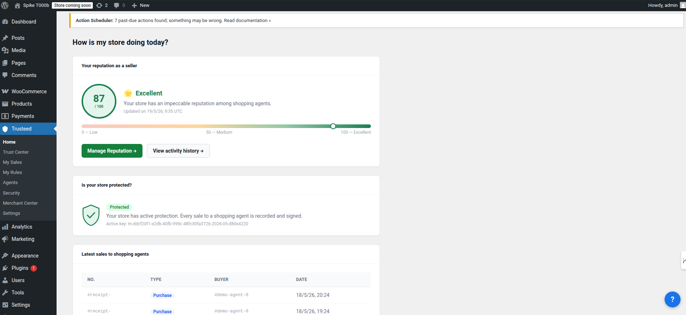
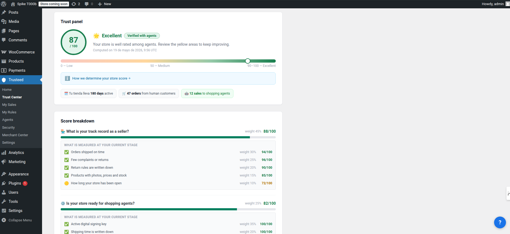
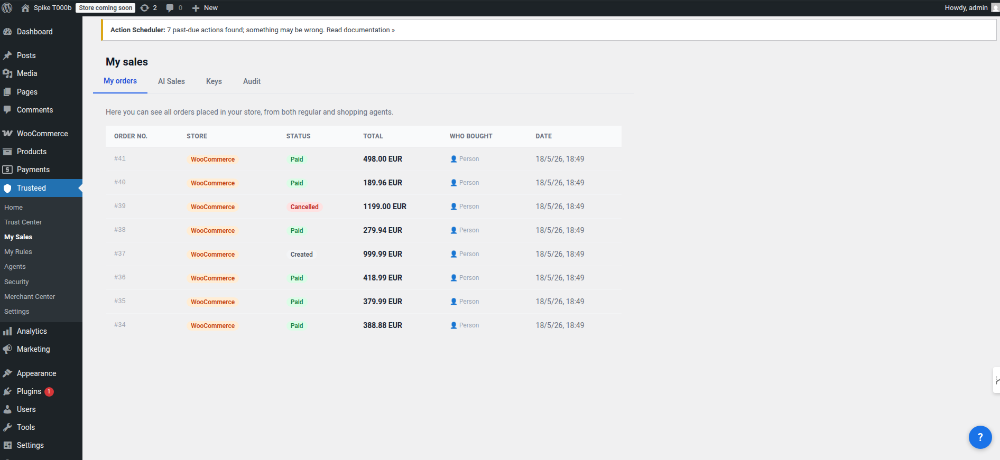
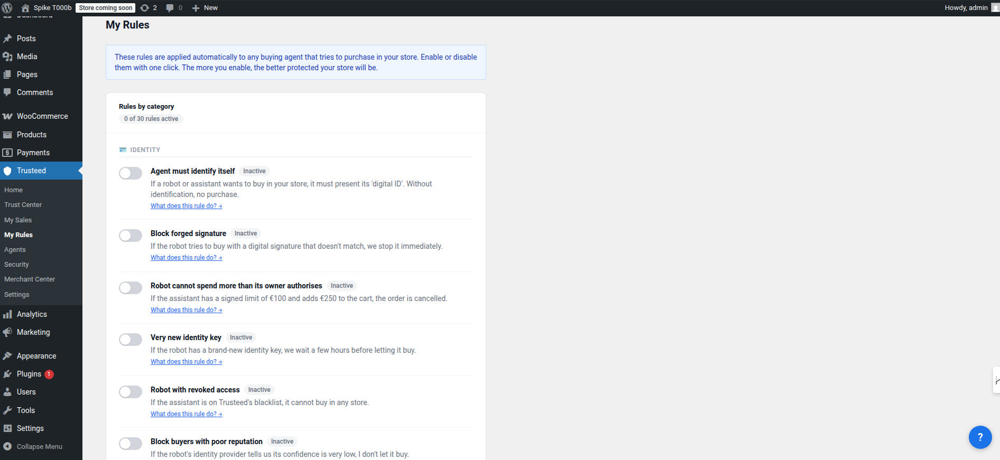
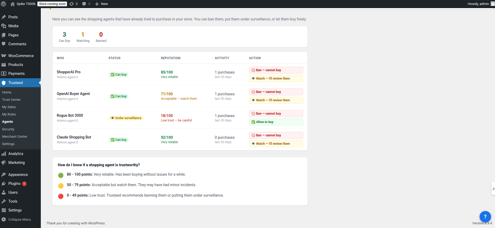
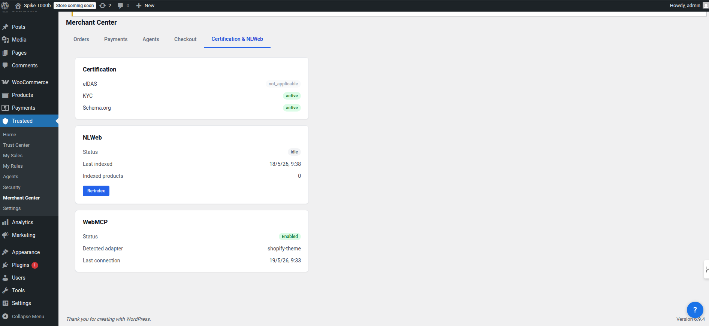

# Trusteed Agentic Commerce for WooCommerce

Enable new online shoppers, AI agents, to make purchases in your store securely and reliably thanks to Trusteed: the network that fosters trust between businesses and agents.

- **Set your business rules**: who you allow to buy, up to what amount, which categories you don't want to offer to agents, set price limits, maintain stock levels to protect yourself against potential fraudulent agents, and more.
- **Tamper-proof receipts**: we generate electronically signed and cryptographically tamper-proof receipts that serve as proof of the actual transaction in case of any dispute. Compatible with eIDAS (EU, UK) and eSIGN (USA) regulations.
- **Agent analytics**: view statistics on agent purchases — how much they spend, what products they buy, and how often.
- **Agent blocking**: block potentially dangerous or problematic agents.
- **Digital currencies**: enables purchases in digital currencies thanks to the X402 protocol.
- **Peer-to-peer transactions**: enables direct peer-to-peer commerce between agents and merchants.

## Screenshots

Each panel below maps to an item in the **Trusteed** menu inside WooCommerce.

| Home | Trust Center | My Sales |
|------|--------------|----------|
|  |  |  |

| My Rules | Agents | Merchant Center |
|----------|--------|-----------------|
|  |  |  |

## Features

Trusteed for WooCommerce is a **thin connector** that bridges your product catalog to the growing ecosystem of AI shopping agents using the **Model Context Protocol (MCP)** — an open standard created by Anthropic. The plugin never processes payments or touches sensitive customer data: checkout always happens in your **native WooCommerce checkout**.

- **MCP tools for agents** — `search_products`, `browse_categories`, `get_product_details`, and `create_cart` (with native WooCommerce checkout redirect)
- **Automatic catalog sync** — products sync via WooCommerce hooks on create/update/delete, including stock changes; full manual sync available from the settings page. Only public catalog data is sent (titles, descriptions, prices, images, categories, stock) — never customer PII, orders, or payment info
- **Agent token verification** — `create_cart` forwards the agent's JWS token through to checkout so signature/replay verification (R002) runs on the normal flow
- **Enforcement gate (HITL)** — configurable human-in-the-loop approval for high-value agent orders
- **SSRF hardening** — store/API URLs validated against an exact host allowlist and RFC1918 / IPv6 ULA / cloud IMDS blocklists
- **Fail-closed defaults** — no dispatch when the enforcement secret is empty; domain-ownership proof required on reconnect (cross-merchant takeover protection)

## Compatibility

| Component | Supported |
|-----------|-----------|
| WordPress | 6.0 – 6.9 |
| WooCommerce | 8.0 – 10.6 |
| PHP | 7.4+ (tested on 8.0–8.3) |

## Requirements

- WordPress 6.0+ with WooCommerce 8.0+
- PHP 7.4 or newer
- A Trusteed account — [sign up free at trusteed.xyz](https://trusteed.xyz)

## Installation

### Manual upload (recommended)

1. **Download the installable `.zip`** from the latest GitHub Release:
   [**⬇ trusteed-agentic-commerce-woocommerce-2.0.1.zip**](https://github.com/Trusteedxyz/agentic-commerce-woocommerce/releases/latest/download/trusteed-agentic-commerce-woocommerce-2.0.1.zip)
   — or browse all versions at the [Releases page](https://github.com/Trusteedxyz/agentic-commerce-woocommerce/releases).
2. In your WordPress admin: **Plugins → Add New → Upload Plugin**.
3. Select the downloaded `trusteed-agentic-commerce-woocommerce-2.0.1.zip` and click **Install Now**.
4. Click **Activate**.

### From source (build the zip yourself)

```bash
git clone https://github.com/Trusteedxyz/agentic-commerce-woocommerce.git
cd agentic-commerce-woocommerce
bash build-zip.sh        # outputs dist/trusteed-agentic-commerce-woocommerce-<version>.zip
```

## Configuration

1. Log in to your WordPress **Admin**.
2. Go to **WooCommerce → Trusteed** (or the **Trusteed** menu item).
3. Enter your **API Key** from [app.trusteed.xyz/settings](https://app.trusteed.xyz/settings).
4. Click **Save & Connect** — the plugin tests connectivity, registers your store, and syncs your catalog automatically.

Once connected, any MCP-compatible agent (Claude, ChatGPT, or custom agents built with LangChain, CrewAI, Vercel AI SDK, etc.) can search your products, browse categories, view product details, and build carts. When the customer is ready to buy, the agent redirects them to your native WooCommerce checkout, where your existing gateways (Stripe, PayPal, …) handle payment.

A detailed merchant walkthrough lives in [`docs/MERCHANT_INSTALLATION_GUIDE.md`](docs/MERCHANT_INSTALLATION_GUIDE.md).

## FAQ

**What data is sent?** Only your public product catalog (titles, prices, descriptions, images, categories, stock status). No customer PII, payment data, or order history. All communication uses HTTPS.

**Which agents are supported?** Any MCP-compatible agent: Claude (Anthropic), ChatGPT (OpenAI), and custom agents built with LangChain, CrewAI, Vercel AI SDK, or any framework that supports the Model Context Protocol.

**Does it slow down my store?** No. The plugin only talks to Trusteed when catalog changes occur — it adds no overhead to storefront page loads or customer checkout.

## Changelog

### 2.0.1

Critical activation + security hotfix (Codex audit). Fixes a half-finished `AGENTICMCP_*` → `TRUSTEED_*` rename that prevented activation in 2.0.0; `create_cart` now forwards the agent JWS token so R002 verification runs; REST client validates the API base host against an exact allowlist.

### 2.0.0

Security & reliability sprint. 2-phase disconnect with confirmation token; reconnect requires domain-ownership proof (`/.well-known/amcp-verify.txt`); real cart-bridge endpoint for `create_cart`; agent-event webhook retries with exponential backoff; SSRF hardening; fail-closed enforcement defaults.

## Support

- Support email: support@trusteed.xyz
- GitHub issues: [github.com/Trusteedxyz/agentic-commerce-woocommerce/issues](https://github.com/Trusteedxyz/agentic-commerce-woocommerce/issues)

## License

GPL-2.0-or-later. See [LICENSE](LICENSE) for full text.
